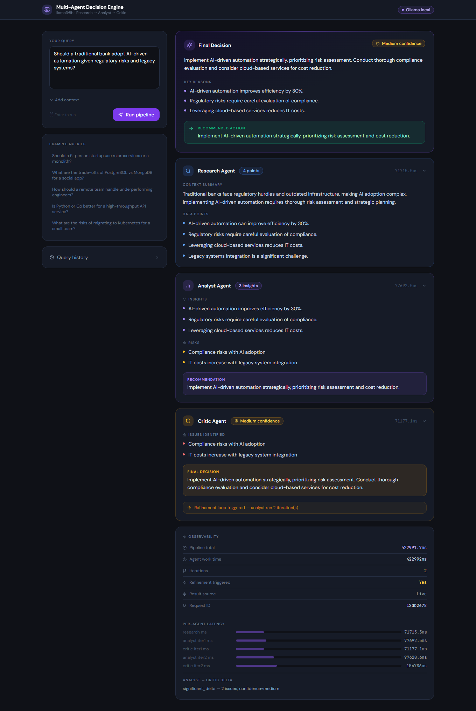
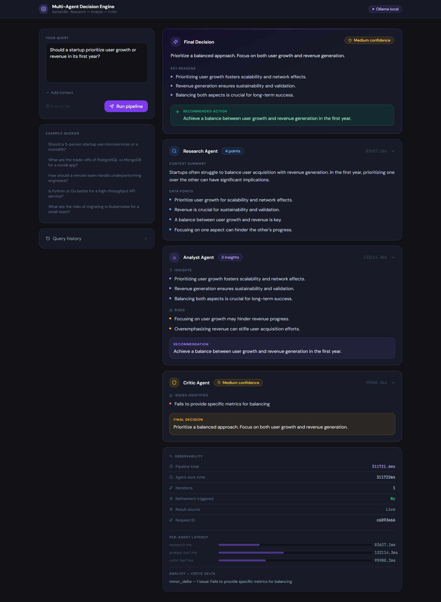
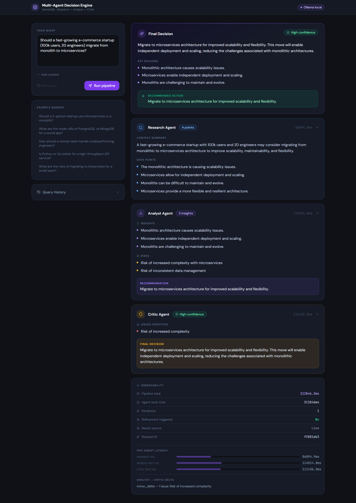

# Multi-Agent AI System — Ollama / llama3:8b

A **fully local**, production-ready autonomous decision engine.  
No external API keys. All inference runs on your machine via **Ollama**.

```
User Input
    ↓
Orchestrator
    ↓
Research Agent  →  data_points[] + context_summary
    ↓
Analyst Agent   →  insights[] + risks[] + recommendation
    ↓
Critic Agent    →  issues[] + confidence + final_decision
    ↓ (optional refinement loop if Critic finds 2+ issues)
Final Output
```

---

## Prerequisites

| Tool    | Min version | Install |
|---------|------------|---------|
| Python  | 3.11+      | python.org |
| Node.js | 18+        | nodejs.org |
| Ollama  | latest     | ollama.ai  |

---

## Step 1 — Install & start Ollama

```bash
# macOS / Linux (via install script)
curl -fsSL https://ollama.ai/install.sh | sh

# Start the Ollama server (keep this terminal open)
ollama serve

# In a second terminal, pull the model (~4.7 GB)
ollama pull llama3:8b

# Verify it works
ollama run llama3:8b "Hello, respond in one sentence."
```

Windows: download the installer from https://ollama.ai/download/windows

---

## Step 2 — Backend setup

```bash
cd backend

# Create and activate virtual environment
python3 -m venv venv
source venv/bin/activate          # Windows: venv\Scripts\activate

# Install dependencies
pip install -r requirements.txt

# Create required directories
mkdir -p logs data

# Start the API server
uvicorn main:app --reload --host 0.0.0.0 --port 8000
```

Backend is live at: http://localhost:8000  
Swagger docs: http://localhost:8000/docs

---

## Step 3 — Frontend setup

```bash
# In a new terminal
cd frontend

npm install
npm run dev
```

Dashboard at: **http://localhost:3000**

---

## Folder structure

```
project-root/
├── backend/
│   ├── main.py                  # FastAPI app, routes, middleware
│   ├── requirements.txt
│   ├── .env                     # config (no secrets needed)
│   ├── agents/
│   │   ├── orchestrator.py      # pipeline coordinator
│   │   ├── research_agent.py    # Research Agent
│   │   ├── analyst_agent.py     # Analyst Agent
│   │   └── critic_agent.py      # Critic Agent
│   ├── utils/
│   │   ├── llm.py               # call_llm() + extract_json()
│   │   ├── logger.py            # console + JSON-file logging
│   │   ├── memory.py            # persistent JSON memory store
│   │   └── cache.py             # in-memory query cache (TTL)
│   └── schemas/
│       └── models.py            # Pydantic v2 schemas
└── frontend/
    ├── index.html
    ├── package.json
    ├── vite.config.js
    ├── tailwind.config.js
    └── src/
        ├── App.jsx              # main dashboard
        ├── api/client.js        # Axios API client
        └── components/
            ├── AgentCard.jsx
            ├── BulletList.jsx
            ├── ConfidenceBadge.jsx
            ├── ErrorAlert.jsx
            ├── FinalDecision.jsx
            ├── HistoryPanel.jsx
            ├── LoadingSkeleton.jsx
            ├── ObservabilityPanel.jsx
            └── PipelineBar.jsx
```
---

## 📸 Demo Screenshots

### 🔹 Multi-Agent Decision Flow


### 🔹 High Confidence Architecture Decision


### 🔹 Business Strategy Analysis


### 🔹 AI Adoption Decision (Banking Use Case)


### 🔹 Ambiguous Input Handling (Critic + Refinement Loop)

---

## API reference

### POST /api/query

**Request:**
```json
{
  "query": "Should our 5-person startup use microservices or a monolith?",
  "context": "Python stack, 8k DAU, growing quickly"
}
```

**Response:**
```json
{
  "decision": "A well-structured monolith is the right choice for your team...",
  "confidence": "high",
  "key_reasons": [
    "Small teams incur disproportionate coordination overhead with microservices",
    "Operational complexity of service meshes typically requires dedicated platform engineers",
    "A modular monolith allows future service extraction without premature commitment"
  ],
  "recommended_action": "Structure your monolith into clearly bounded modules now...",

  "research_output": {
    "data_points": ["Netflix adopted microservices at 1000+ engineers...", "..."],
    "context_summary": "The debate centres on organisational scale and operational maturity..."
  },
  "analyst_output": {
    "insights": ["...", "..."],
    "risks":    ["...", "..."],
    "recommendation": "..."
  },
  "critic_output": {
    "issues_identified": [],
    "confidence_adjustment": "high",
    "final_decision": "...",
    "needs_refinement": false
  },
  "_meta": {
    "request_id": "a3b2c1d0",
    "iterations": 1,
    "refinement_triggered": false,
    "delta": "no_delta — critic accepted analyst output",
    "timings_ms": {
      "research_ms": 8420,
      "analyst_iter1_ms": 12340,
      "critic_iter1_ms": 9870
    },
    "pipeline_ms": 30680
  }
}
```

### GET /health
```json
{ "status": "ok", "service": "Multi-Agent AI System", "model": "llama3:8b" }
```

### GET /api/memory — last N decisions  
### DELETE /api/memory — clear history  
### GET /api/cache/stats — cache hit/miss stats

---

## Observability

All logs are written to `backend/logs/agents.log` in JSON Lines format, e.g.:

```json
{"ts":"2025-01-15T10:23:45Z","level":"INFO","logger":"agent_system.orchestrator","msg":"[a3b2c1d0] Pipeline END  confidence=high iterations=1 total=30680ms"}
```

Every log line carries `request_id` for full end-to-end traceability.

---

## Performance notes

| Model       | Avg pipeline time |
|-------------|------------------|
| llama3:8b   | ~25-40 seconds   |
| llama3:70b  | ~90-150 seconds  |

To change the model, edit `backend/utils/llm.py`:
```python
MODEL = "llama3:70b"   # or mistral, phi3, gemma2, etc.
```

---

## How to zip the project

### Method 1 — Command line (recommended)

```bash
# From the project-root directory
cd /path/to/project-root

zip -r multi_agent_ai_system.zip . \
  --exclude "*/venv/*" \
  --exclude "*/node_modules/*" \
  --exclude "*/__pycache__/*" \
  --exclude "*/.git/*" \
  --exclude "*.pyc" \
  --exclude "*/logs/*.log" \
  --exclude "*/data/*.json"
```

This creates `multi_agent_ai_system.zip` (~50-100 KB) excluding generated/cache files.

### Method 2 — macOS Finder / Windows Explorer

1. Select the `project-root` folder  
2. Right-click → **Compress** (macOS) or **Send to → Compressed folder** (Windows)  
3. Rename the result to `multi_agent_ai_system.zip`

### Method 3 — Python (cross-platform)

```python
import zipfile, os, pathlib

ROOT    = pathlib.Path(".")
EXCLUDE = {"venv", "node_modules", "__pycache__", ".git", "logs", "data"}

with zipfile.ZipFile("multi_agent_ai_system.zip", "w", zipfile.ZIP_DEFLATED) as zf:
    for file in ROOT.rglob("*"):
        if file.is_file() and not any(p in file.parts for p in EXCLUDE):
            zf.write(file)

print("Created multi_agent_ai_system.zip")
```

---

## Troubleshooting

| Problem | Fix |
|---------|-----|
| `Connection refused` on `/api/query` | Run `ollama serve` in a terminal |
| `model 'llama3:8b' not found` | Run `ollama pull llama3:8b` |
| Responses are very slow | Normal for local LLMs; use GPU if available |
| JSON parse errors | Model occasionally produces malformed JSON; retry the request |
| CORS errors in browser | Ensure backend is on port 8000 and frontend on 3000 |
